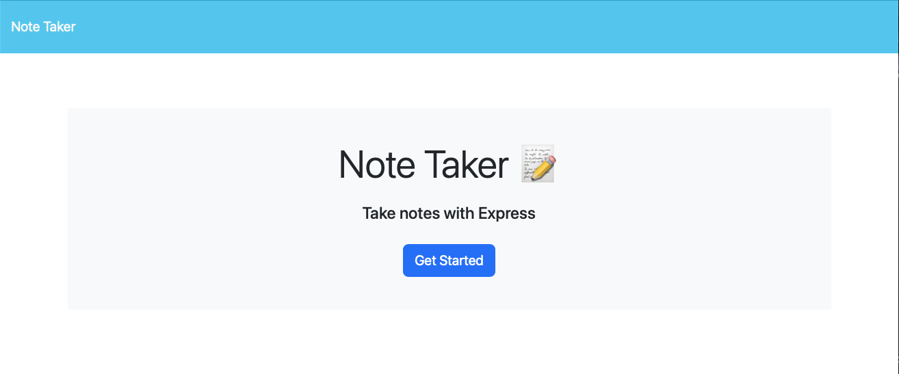
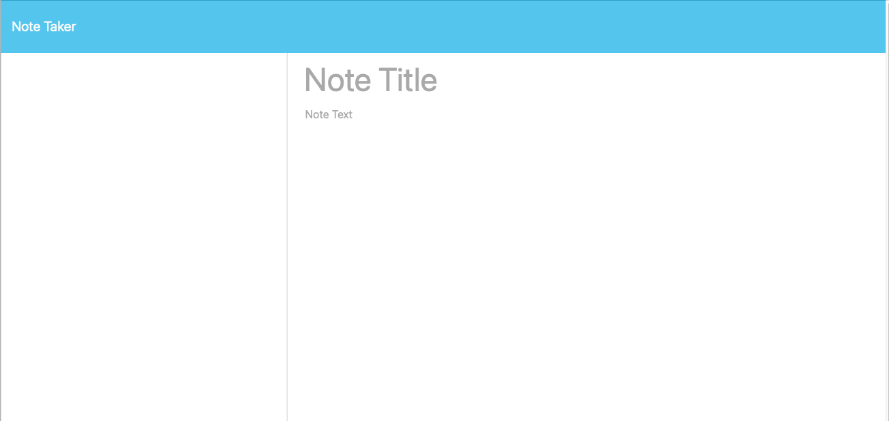
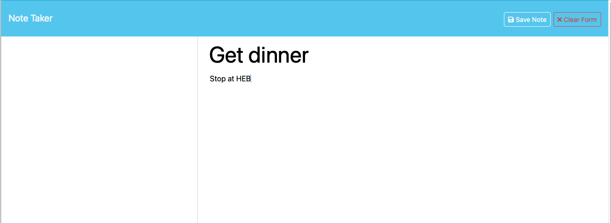

# note-taker

## Description

My motivation for this project was to build an application that would allow a user to keep notes.

I built this project to utilize the skills that I am learning by bringing back end development and front end development together in one project.

Ideally this application would solve the need for keeping a list of notes. Once a note is typed in and saved it would appear in the side bar for the user to see and keep track of.

I have learned that I still have a lot to learn in bring front end and back end applications together. While my routes are hitting like they are supposed to, and I was able to deploy the application via heroku, my notes are not displaying as they should. Clearly this application is a work in progress.

## Installation

You can install this application by copying the code and running it in your terminal or by clicking the link below:

https://kathryn-note-taker-7e3bc28adce6.herokuapp.com 

## Usage

Unfortunately there isn't much usage in the project as it stands. When the application is deployed you are presented with the opening page as seen below:

Following that, once you select get started you are directed to the notes app where you can type up your notes:

And finally, once you have entered your note you are able to save it:

## Credits

I used my resources provided to me by the bootcamp I am enrolled in, specifically I rewatched the video session on the topic of express.js.

I also used the following website to get the npm package for generating unique id's:

https://www.npmjs.com/package/uniqid

